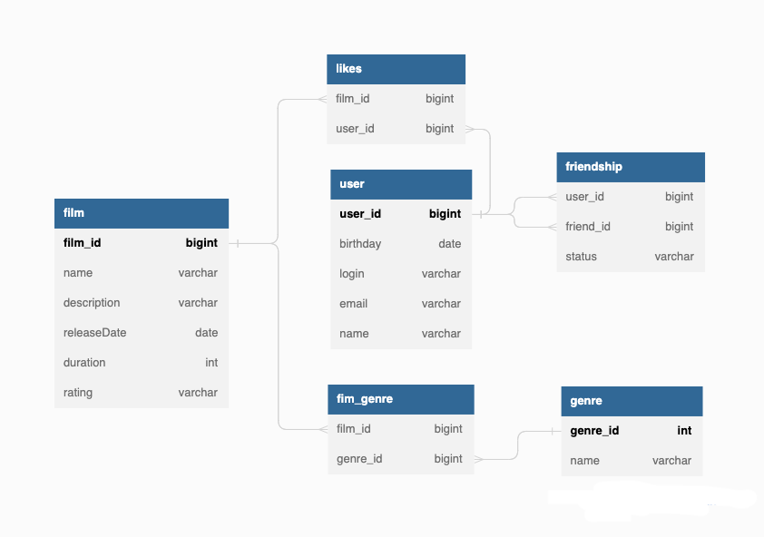

# java-filmorate 
## ER-диаграмма, отражающая взаимосвязь существующих таблиц базы данных


## Пояснения логики дружбы
- дружба является односторонней. Это значит, что если какой-то пользователь оставил вам заявку в друзья, то он будет в списке ваших друзей, а вы в его — нет.
- Удаление из друзей равноценно отмене ранее отправленного запроса на добавление в друзья с соответствующим изменением статуса дружбы
- Подтверждение заявки на добавление в друзья равноценно ответной отправке заявки на добавление в друзья с соответствующим изменением статуса дружбы. 
## Примеры запросов к базе данных
### 1. Работа с сущностью film
- *Получение списка всех фильмов*
```
    SELECT *
    FROM film
```
- *Получение списка из id 10 самых популярных фильмов*
```
    SELECT f.film_id
    FROM film AS f 
    LEFT JOIN likes AS l ON f.film_id = l.film_id
    GROUP BY f.film_id
    ORDER BY COUNT(l.user_id) DESC
    LIMIT 10
```
- *Получение фильма по id*
```
    SELECT *
    FROM film AS f
    WHERE f.film_id = :id
```

### 2. Работа с сущностью user
- *Получение списка всех пользователей*
```
    SELECT *
    FROM user
```
- *Получение пользователя по id*
```
    SELECT *
    FROM user AS u
    WHERE u.user_id = :id
```
- *Получение списка из id друзей пользователя*
```
SELECT f.friend_id
FROM friendship AS f
WHERE f.user_id = 2 AND f.status = 'CONFIRMED'
UNION
SELECT f.user_id
FROM friendship AS f
WHERE f.friend_id = 2 AND f.status = 'CONFIRMED' OR f.status = 'UNCONFIRMED'
```
- *Получение списка id общих друзей двух пользователей*
```
    SELECT *
    FROM (
        SELECT f.friend_id as friend
        FROM friendship AS f
        WHERE f.user_id = :id1 AND f.status = 'CONFIRMED'
        UNION
        SELECT f.user_id as friend
        FROM friendship AS f
        WHERE f.friend_id = :id1 AND f.status = 'CONFIRMED'
    ) AS user1_friends
    INNER JOIN (
        SELECT f.friend_id as friend
        FROM friendship AS f
        WHERE f.user_id = :id2 AND f.status = 'CONFIRMED'
        UNION
        SELECT f.user_id as friend
        FROM friendship AS f
        WHERE f.friend_id = :id2 AND f.status = 'CONFIRMED'
    ) AS user2_friends
    ON user1_friends.friend = user2_friends.friend
```